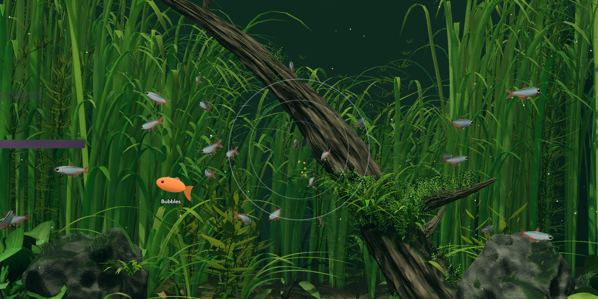
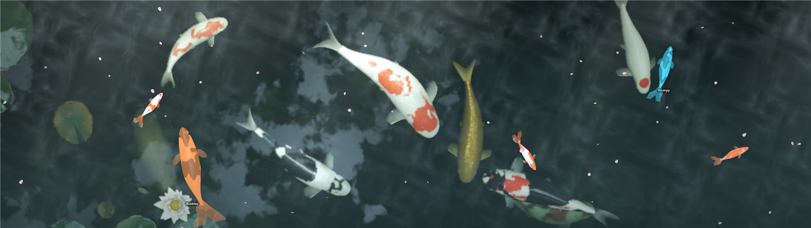
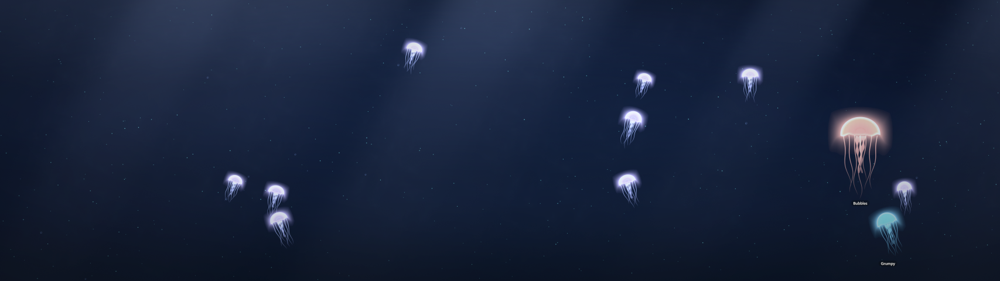
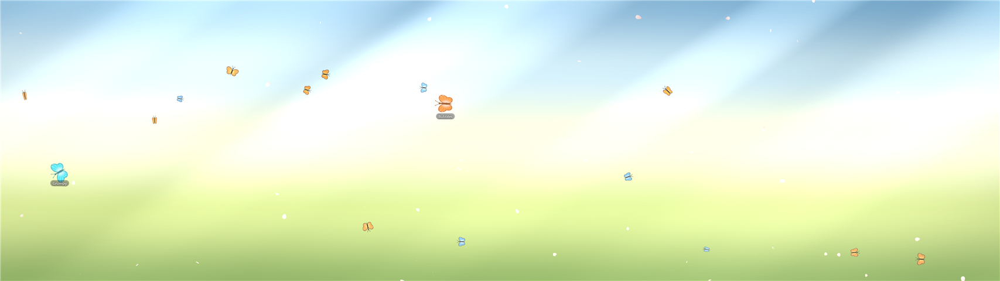
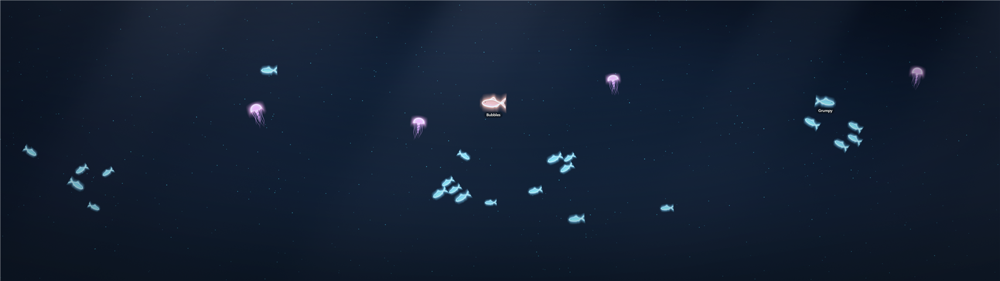
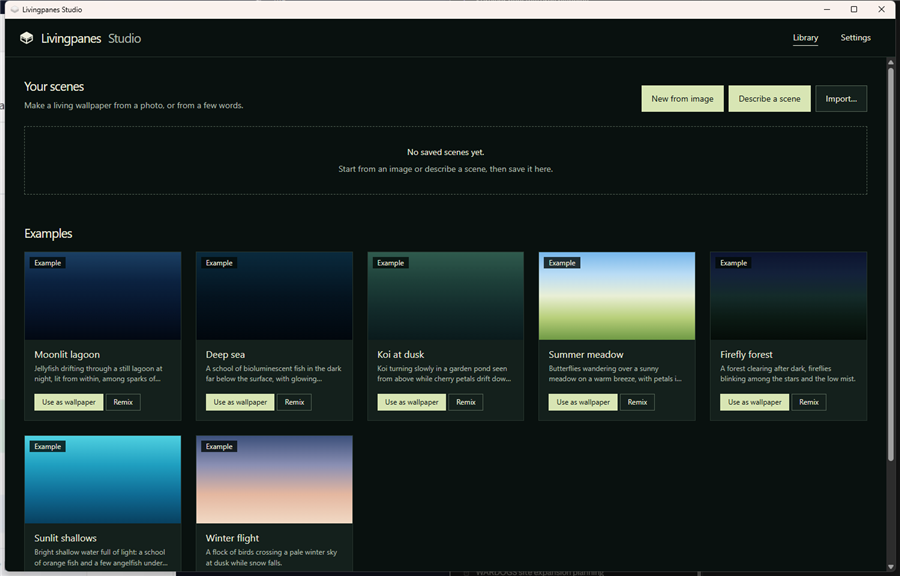

# Livingpanes

**Living 3D worlds for your Windows 11 desktop.** Fish that drift behind your icons and
scatter when you tap the glass. A pet that grows when you feed it and sulks when you
forget. Light that follows the time of day. Make your own world from a photo, or just
describe one in a sentence.

[](docs/videos/riverscape.mp4)

> [!IMPORTANT]
> **Livingpanes is built on [Deskworlds](https://github.com/chaseleantj/deskworlds) by
> [Chase Lean](https://github.com/chaseleantj).** The six handcrafted worlds, the
> rendering, and the original idea are his. He made them for macOS and shared them for
> free under the MIT license. Livingpanes brings them to Windows and adds the Studio, pets
> and other toys on top. **Thank you, Chase.** If you like this, please
> [star the original](https://github.com/chaseleantj/deskworlds). Full credits are in
> [CREDITS.md](CREDITS.md).

Everything runs on your own PC. There is no account, no tracking, and no internet use,
except two optional features that you start yourself: the one-time 3D depth model
download, and "describe a scene", which uses your own Claude API key.

---

## What you get

- **Six handcrafted worlds by Chase Lean:** Riverbed, Coral reef, Betta, Plasma globe,
  Koi pond and Bonfire.
- **A wallpaper that stays out of the way.** It draws behind your desktop icons on every
  monitor. It slows down when windows cover it, stops when the screen is covered or
  locked, and honors battery saver.
- **Tap the glass.** Press **Ctrl+Alt+T**: a ripple spreads from your cursor and the fish
  scatter.
- **Food where you point.** Press **Ctrl+Alt+F** to drop food at the cursor.
- **Pets.** Adopt up to six named fish. They eat what you drop, grow over days of
  feeding, and sulk under a little cloud after a day without food.
- **Light that follows your clock.** Gentle moonlight at night, warm light at dawn and
  dusk.
- **The Studio**, for making your own worlds:
  - **from a photo.** Your image, at full quality, becomes a living scene with ripples,
    light rays, drifting particles and creatures you choose. Turn on **3D depth**, and a
    small AI model running on your PC works out what is near and far, so the photo
    shifts in 3D as you move the mouse.
  - **from a sentence.** Type "koi under cherry blossoms at dusk", and Claude designs the
    scene. You can also combine a photo and a sentence.
  - **shared with friends.** Export a scene as a `.livingpane` file. Anyone can import it.



### Made in the Studio

| | |
| --- | --- |
|  **From a photo**, with 3D depth: ripples, light patterns on the water, drifting petals and live koi over the picture |  **Moonlit lagoon**: glowing jellyfish. The two big ones are pets |
|  **Summer meadow**: butterflies on a warm breeze |  **Deep sea**: a glowing school far below the surface |

The photo above is a still of Chase Lean's Koi pond, used to show the photo feature.

---

## Install

You need Windows 10 or 11 (64-bit). The WebView2 runtime it uses is already part of
Windows 11.

1. Go to **[the latest release](https://github.com/kstruck/Livingpanes/releases/latest)**.
   Download `Livingpanes-<version>-win-x64.zip`.
2. Right-click the zip, choose **Extract All…**, then click **Extract**.
3. Open the extracted folder. Right-click **`install.ps1`**, then choose **Run with
   PowerShell**.
   - If Windows says "running scripts is disabled", open PowerShell in that folder and
     run:
     ```powershell
     powershell -ExecutionPolicy Bypass -File .\install.ps1
     ```
4. You should see `Livingpanes installed`. A world appears behind your icons within
   about 10 seconds. To see it, press **Win+D**.
5. The Livingpanes icon (a small layered slab) sits in the system tray, next to the
   clock. If you cannot see it, click the **^** arrow there.

> [!NOTE]
> The app is not code-signed (signing costs money every year). Windows SmartScreen may
> warn about it the first time. The source is all here, and the release is built by
> [GitHub Actions](.github/workflows/release.yml) from this code.

It installs to `%LOCALAPPDATA%\Programs\Livingpanes`, adds itself to sign-in, and puts
**Livingpanes** and **Livingpanes Studio** in the Start menu. It needs no admin rights.

### From source

You need the [.NET 10 SDK](https://dotnet.microsoft.com/download). Clone the repo, then
run this in its folder:

```powershell
powershell -ExecutionPolicy Bypass -File windows\install.ps1
```

---

## Using it

Right-click (or left-click) the tray icon:

| Menu item | What it does |
| --- | --- |
| *status line* | What the wallpaper is doing, and why, e.g. "Resting behind your windows" |
| **World** | Pick a world: Chase's six, the Studio examples, or your own |
| **Studio…** | Make your own world |
| **Feed** (Ctrl+Alt+F) | Food for the creatures. The hotkey drops it at the cursor |
| **Tap the glass** (Ctrl+Alt+T) | A ripple from the cursor; everything nearby scatters |
| **Pets** | Adopt, rename, recolor or let go of a pet |
| **Pause / Resume** | Stop or start the motion |
| **Light follows the clock** | Day, dusk and night lighting from your PC's clock |
| **Hotkeys** | Turn Ctrl+Alt+F and Ctrl+Alt+T on or off |
| **Quit** | Stop until the next sign-in |

Your desktop icons, right-click menu and drag-and-drop all keep working. The world
never takes your clicks.

### Pets

1. Tray icon → **Pets** → **Adopt a pet…**
2. Type a name, pick a color, click **OK**. Your pet swims in the water worlds on your
   main screen.
3. Feed it with **Feed** or **Ctrl+Alt+F**. A meal counts toward growing at most every
   ten minutes, so it grows over days, not in one burst of clicking.
4. Skip a day and it sulks: slow, grey, a little cloud overhead. One feeding cheers it up.

---

## The Studio

Open it from the tray (**Studio…**) or the Start menu (**Livingpanes Studio**).



### Make a world from a photo

1. Click **New from image**, then choose a JPG, PNG or BMP. Use the largest file you
   have. It is shown at full resolution, unless it is bigger than your graphics card
   can hold (usually 16384 pixels on a side); then it is scaled down to fit.
2. Pick **Water** or **Air**, then add creatures, particles and effects. The preview
   updates as you change things.
3. *(Optional)* Turn on **3D depth parallax**. The first time, this downloads a 99 MB
   model ([Depth Anything V2 Small](https://huggingface.co/depth-anything/Depth-Anything-V2-Small),
   Apache-2.0) and checks its fingerprint. After that it works offline and takes a few
   seconds per photo.
4. Name it, click **Save**, then **Use as wallpaper**.

### Describe a world

1. Get an API key at **console.anthropic.com → API keys**. In the Studio, open
   **Settings**, paste it, and click **Save**. The key is encrypted for your Windows user
   and never leaves the app except to go to Anthropic.
   - If your key is not tied to a workspace, Anthropic asks which workspace to bill. Copy
     the workspace ID (it starts with `wrkspc_`) from **console.anthropic.com → Settings →
     Workspaces**, paste it into **Workspace ID** in Studio Settings, and click **Save**.
2. Click **Describe a scene**, type what you want, and click **Create**. A scene costs a
   few cents on your Anthropic account.
3. Adjust anything you like, then **Save**.

You can add a photo first and then describe what should live in it.

**Let Claude write code** (in **Advanced**, off by default) lets Claude write a whole
custom scene in JavaScript for things the built-in engine cannot draw. The code runs
with no internet access, and the Studio shows it to you and will not run it until you
tick **"I've read this code and want to run it."** See [SECURITY.md](SECURITY.md).

### Share a world

**Export** saves a `.livingpane` file. **Import…** adds one that someone sent you.
Imported code never runs until you have read it.

---

## Troubleshooting

| Problem | Fix |
| --- | --- |
| The world is frozen and the menu says "Paused, for Animation effects off" | Windows **Settings → Accessibility → Visual effects → Animation effects** is off, so Livingpanes starts paused on purpose. Click **Resume** to run it anyway. |
| "Resting behind your windows" | Working as intended: windows cover the screen. Press **Win+D** to look. |
| Ctrl+Alt+F or Ctrl+Alt+T does nothing | Another app owns that shortcut. The log says so. Use the tray menu instead. |
| "This API key is not tied to a workspace" when you click **Create** | Paste your workspace ID into Studio **Settings → Workspace ID**, or make a new key inside a workspace. |
| Nothing shows at all | Check the log at `%LOCALAPPDATA%\Livingpanes\livingpanes.log`, then [open an issue](https://github.com/kstruck/Livingpanes/issues/new/choose) with its last lines. |
| "needs the Microsoft Edge WebView2 Runtime" | Install it from [Microsoft](https://developer.microsoft.com/microsoft-edge/webview2/) (Windows 10 only; Windows 11 has it). |

## Uninstall

Run `uninstall.ps1` from the install folder, or from a clone:

```powershell
powershell -ExecutionPolicy Bypass -File "$env:LOCALAPPDATA\Programs\Livingpanes\uninstall.ps1"
```

Your scenes, pets and API key are kept in `%LOCALAPPDATA%\Livingpanes`. Add
`-RemoveData` to delete them too.

---

## For developers

- [ARCHITECTURE.md](ARCHITECTURE.md): how the host, the pages, the Studio and the engine
  fit together, and every contract between them.
- [CONTRIBUTING.md](CONTRIBUTING.md): how to build, test and send changes.
- [scenes/studio/README.md](scenes/studio/README.md): the scene recipe and the code-scene API.
- Try the scenes in a browser, with no Windows host: `npm start`, then open
  http://127.0.0.1:8080.
- macOS: Chase's original app still lives in `wallpaper/`; see
  [the original README](docs/DESKWORLDS-README.md).

## Credits and license

Built on **[Deskworlds](https://github.com/chaseleantj/deskworlds) by Chase Lean**,
and found through
[the r/ClaudeAI post that shared it](https://www.reddit.com/r/ClaudeAI/comments/1x02pno/i_asked_opus_55_to_generate_an_extremely/).
three.js, ONNX Runtime, Depth Anything V2 and the Anthropic SDK are credited in
[CREDITS.md](CREDITS.md).

[MIT](LICENSE), the same as Deskworlds. Chase's copyright notice is kept, as the license
asks.
